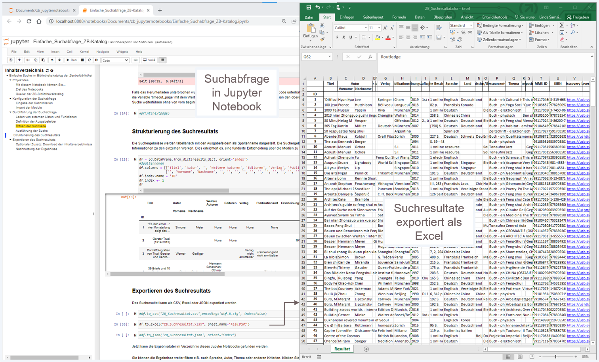
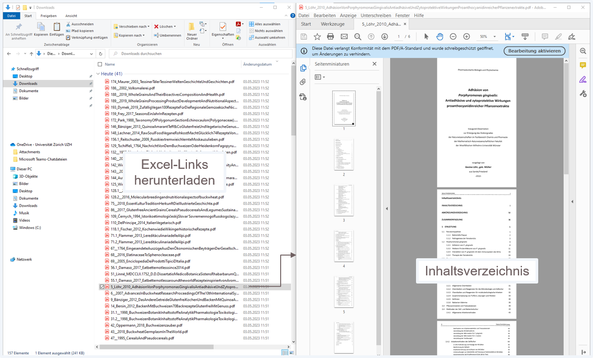

# *Zentralbibliothek Zürich*: Suchabfrage des Bibliothekskatalogs 

Willkommen auf der Startseite der Zentralbibliothek Zürich zur Nutzung von Jupyter Notebooks, die eine Suchabfrage des Bibliothekatalogs ermöglichen! Dies ist das erste Projekt in der Reihe und dient dazu, den Bibliothekskatalog mit Suchbegriffen abzufragen und die Suchresultate in Excel, CSV oder JSON lokal abzuspeichern. Im Kern geht es darum, eine einfache Stichwortsuche auszuführen und aus dem SLSP-Bibliothekskatalog diejenigen Medien als Resultate zurückzubekommen, die zutreffen. Das ermöglicht es den Benutzern, 
* schweizweite Katalogdaten als Grundlage für die akademische Forschungsarbeit zu beziehen
* Medien der Bibliotheken über Swisscovery-Links einfach zu bestellen und auszuleihen
* PDFs über die Inhaltsverzeichnis-Links in der Ergebnisdatei herunterzuladen
* statistische Analysen von Katalogdaten durchzuführen.

## Installation 

Um das Projekt lokal auf Ihrem Computer auszuführen, laden Sie dieses Github-Verzeichnis auf Ihren Computer herunter oder klonen Sie es auf Ihren Computer. 
Navigieren Sie zur Jupyter Notebook-Datei im heruntergeladenen Github-Verzeichnis und öffnen Sie es, um es auszuführen. 
Zuerst müssen die Module auf Ihrem Computer installiert werden. Kommentieren Sie dazu den Code-Block "Module installieren" ein und führen Sie den Code-Block aus. 

## Benutzung

Nach der Installation aller Modul-Abhängigkeiten auf Ihrem Computer können Sie das Jupyter Notebook ausführen, in dem Sie den Code-Block "Module installieren" wieder auskommentieren und alle anderen Code-Blocks im Jupyter Notebook einzeln nacheinander oder in einem Zug durchlaufen lassen. Öffnen Sie zuletzt Ihren Explorer auf Ihrem Computer, navigieren Sie zum Projekt-Verzeichnis und suchen Sie nach dem Suchergebnis, um es anzuzeigen. 

## Beitrag
Sie können zu diesem Jupyter Notebook-Projekt beitragen. Dazu öffnen Sie "Issues" auf GitHub, um Fehler zu melden oder neue Funktionen vorzuschlagen. Wenn Sie Code-Änderungen vorschlagen möchten, erstellen Sie bitte einen Pull Request. 

## Lizenz 
Dieses Jupyter Notebook-Projekt wurde unter der MIT-Lizenz veröffentlicht. Lesen Sie die Lizenzdatei für weitere Informationen. 
